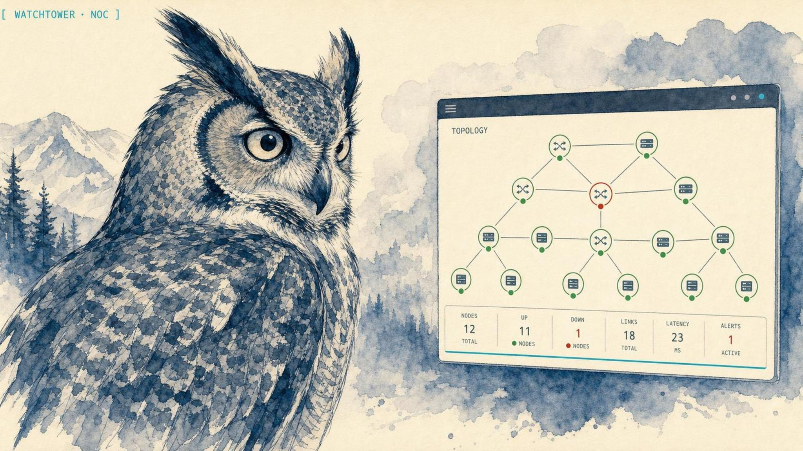

<p align="center">
  
</p>

<h1 align="center">Watchtower</h1>

<p align="center">
  <strong>A self-hosted NOC dashboard for homelab and small-network operators: device status, topology, interface utilization, and alerts in one live console.</strong>
</p>

<p align="center">
  <strong>Website:</strong> <a href="https://lidless.dev/watchtower">lidless.dev/watchtower</a>
</p>

<p align="center">
  
  
  
  
</p>

Watchtower is a self-hosted Network Operations Center (NOC) dashboard that watches network devices, interfaces, VMs, and alerts through LibreNMS and Proxmox, with WebSocket-driven live updates. It exists because the raw LibreNMS UI is a deep tool built for engineers running it all day, and a general dashboard like Grafana means hand-building every panel and query before you see a single device; Watchtower is the opinionated middle: one console that already knows what a homelab operator wants to see. It is a work in progress, run from source, and is not published to any package registry.

---

## Proof

> **Screenshot coming.** A real dashboard screenshot is the top deferred item for this repo. The banner above is an illustration, not a capture of the running UI. Until a real screenshot lands, the capability list below is the honest description of what the dashboard shows.

---

## What it does

Watchtower is a NOC dashboard for **network monitoring** in a homelab or small network. It polls **LibreNMS** and **Proxmox** on a schedule, caches current state in Redis, stores history in InfluxDB, and pushes changes to the browser over **WebSockets** so device status, interface graphs, and alerts stay current without a page refresh. The frontend is **React 18 + TypeScript**; the backend is a **FastAPI** service on **Python 3.12** with **APScheduler** driving the polling loop. Instead of jumping between the LibreNMS web UI, the Proxmox console, and a Grafana tab, you get one screen for device health, topology, interface utilization, and the alert feed.

---

## Quickstart

### Prerequisites

- Python 3.12+
- Node.js 20+
- Docker + Docker Compose (provides Redis and InfluxDB)
- A LibreNMS instance with API access

### Clone and build

```bash
git clone https://github.com/solomonneas/watchtower.git
cd watchtower

# backend
cd backend
python -m venv venv && source venv/bin/activate
pip install -r requirements.txt -r requirements-dev.txt

# frontend
cd ../frontend
npm install
npm run build
```

### Bring up Redis and InfluxDB

InfluxDB refuses to start without a password and admin token, so generate them first.

```bash
cp .env.example .env
# edit .env and set WATCHTOWER_INFLUXDB_PASSWORD and WATCHTOWER_INFLUXDB_ADMIN_TOKEN,
# e.g. each to the output of: openssl rand -hex 32

docker compose up -d
```

### Configure

```bash
cp config/config.example.yaml config/config.yaml
cp config/topology.example.yaml config/topology.yaml
```

Edit `config/config.yaml` with your own LibreNMS and Proxmox credentials. The values below are placeholders, fill them in with your stack (use your real hosts, not these example addresses):

```yaml
auth:
  admin_user: admin
  admin_password_hash: ""          # set on first login
  jwt_secret: "change-this-to-a-random-secret-in-production"

data_sources:
  librenms:
    url: "http://librenms.example.internal"
    api_key: "<your-librenms-api-key>"

  proxmox:
    url: "https://proxmox.example.internal:8006"
    token_id: "watchtower@pam!monitoring"
    token_secret: "<your-token-secret>"
    verify_ssl: false
```

### Run

```bash
# development
cd backend && uvicorn app.main:app --reload
cd frontend && npm run dev

# production (systemd, after install/install.sh)
sudo systemctl start watchtower
```

Run the local verification gate before committing changes:

```bash
./scripts/verify
```

It runs `ruff check`, `pytest -q`, the frontend lint and unit tests, and the production build.

---

## What it watches

| Capability | What you get |
|---|---|
| **Device status** | Real-time up / down / degraded state, pushed over WebSockets. |
| **Network topology** | Interactive React Flow map with link status and port detail. |
| **Interface utilization** | Bandwidth, errors, and traffic graphs per interface. |
| **Port groups** | Aggregate traffic for groups of ports matched by description. |
| **Speedtest** | Scheduled WAN speed tests with historical tracking. |
| **Alert feed** | Critical / warning / info severities with an acknowledgment workflow. |
| **Notifications** | Discord, Pushover, and email channels with configurable thresholds. |
| **Proxmox integration** | VM / LXC status, resource usage, and node details. |
| **Historical data** | InfluxDB time-series with configurable retention. |
| **CDP / LLDP discovery** | Automatic topology discovery from LibreNMS. |

Administration covers a web-based settings UI for integrations and thresholds, JWT authentication with role-based permissions, and admin user management.

---

## Tech stack

| Layer | Technology |
|-------|------------|
| Frontend | React 18, TypeScript, Tailwind CSS |
| State | Zustand |
| Visualization | React Flow, Recharts |
| Backend | FastAPI, Python 3.12 |
| Live updates | WebSockets (`/ws/updates`) |
| Cache | Redis |
| Time series | InfluxDB |
| Scheduler | APScheduler |
| Auth | JWT + bcrypt |

| Integration | Purpose |
|---|---|
| **LibreNMS** | Device polling, SNMP data, alerts, CDP/LLDP topology |
| **Proxmox** | VM/LXC monitoring, node health, storage |
| **InfluxDB** | Historical metrics and graphs |
| **Netdisco** | Network inventory (optional) |

---

## Why not just LibreNMS or Grafana?

- **The raw LibreNMS UI** is the authoritative source for SNMP polling and alerting, but it is built for someone living in it. Watchtower reads LibreNMS through its API and presents the homelab-relevant slice (device status, interface graphs, topology, alerts) on one screen, with live WebSocket updates instead of page reloads.
- **Grafana** is a general-purpose dashboard. It can show all of this, but you build every panel, datasource, and query yourself. Watchtower ships with the NOC view already assembled: it knows it is watching network devices and VMs, so the topology map, port groups, and alert workflow are built in rather than hand-wired.
- **Proxmox + LibreNMS as separate tabs** is what most homelabs actually do. Watchtower folds VM/LXC status from Proxmox and device status from LibreNMS into a single console so you stop tab-hopping during an incident.

---

## What Watchtower is not

- It is **not** an MCP server. It is a web application with a browser UI, so there is no AI-client config block.
- It is **not** published to any package registry. You run it from source.
- It is **not** a replacement for LibreNMS or Proxmox. It is a read-and-present layer on top of them; it does not poll SNMP itself or manage VMs.
- It is **not** a hosted SaaS. Everything runs on the machine you control.
- It is a **work in progress**. Expect rough edges and breaking changes.

---

## Project structure

```
watchtower/
├── frontend/          # React 18 + TypeScript (Vite)
│   └── src/           # api, components, pages, store, types
├── backend/           # FastAPI service (Python 3.12)
│   └── app/           # routers, polling, history, services, websocket
├── config/            # config.example.yaml, topology.example.yaml
├── scripts/           # verify, update, backup, restore, setup-influxdb
├── install/           # install.sh (systemd service)
└── docker-compose.yml # Redis + InfluxDB
```

---

## Updating

```bash
./scripts/update.sh
```

Pulls the latest code, installs dependencies, rebuilds the frontend, and restarts the service.

---

## Contributing and security

- [CONTRIBUTING.md](CONTRIBUTING.md): what lands easily and how to run the dev loop.
- [SECURITY.md](SECURITY.md): how to report a vulnerability (private, not a public issue).
- [CODE_OF_CONDUCT.md](CODE_OF_CONDUCT.md): how we work together.
- [CHANGELOG.md](CHANGELOG.md): notable changes.

---

## License

MIT. See [LICENSE](LICENSE).
